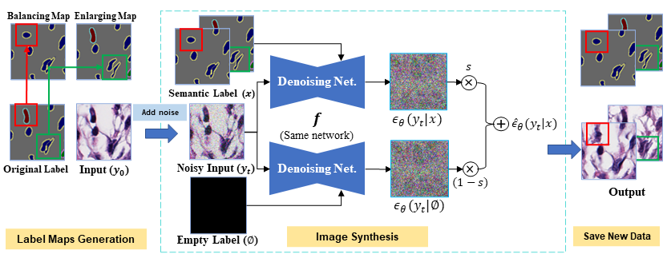

## DiffMix: Diffusion Model-based Data Synthesis for Nuclei Segmentation and Classification in Imbalanced Pathology Image Datasets
By [Hyun-Jic Oh](https://scholar.google.com/citations?user=wwcyjfAAAAAJ&hl=ko&oi=ao) and [Won-Ki Jeong](https://scholar.google.com/citations?user=bnyKqkwAAAAJ&hl=ko&oi=ao)

This is official implementation code of DiffMix (MICCAI2023)
___
[[Paper](https://arxiv.org/abs/2306.14132)]



#### Abstract
- Nuclei segmentation and classification is a significant process in pathology image analysis. Deep learning-based approaches have greatly contributed to the higher accuracy of this task. However, those approaches suffer from the imbalanced nuclei data composition, which shows lower classification performance on the rare nuclei class. In this paper, we propose a realistic data synthesis method using a diffusion model. We generate two types of virtual patches to enlarge the training data distribution, which is for balancing the nuclei class variance and for enlarging the chance to look at various nuclei. After that, we use a semantic-label-conditioned diffusion model to generate realistic and high-quality image samples. We demonstrate the efficacy of our method by experiment results on two imbalanced nuclei datasets, improving the state-of-the-art networks. The  experimental results suggest that the proposed method improves the classification performance of the rare type nuclei classification, while showing superior segmentation and classification performance in imbalanced pathology nuclei datasets.

#### Dataset Preparation
- [CoNSeP](https://warwick.ac.uk/fac/cross_fac/tia/data/hovernet/)
- [GLySAC](https://drive.google.com/drive/folders/1p0Yt2w8MTcaZJU3bdh0fAtTrPWin1-zb)

#### Implementation
- Requirements
```
pip install -r requirements.txt
```
You can train SDM with the script "semantic-diffusion-model/scripts_ddim_sample" for two public pathology nuclei datasets "CoNSeP" and "GlySAC".
- Training code: image_train.py
- Sampling code: image_sample.py

#### Acknowledge
Our code is developed based on [Semantic Image Synthesis via Diffusion Models (SDM)](https://github.com/WeilunWang/semantic-diffusion-model) and [GradMix](https://github.com/QuIIL/Grad_Mix).

#### Citation
Please cite us if you use our work